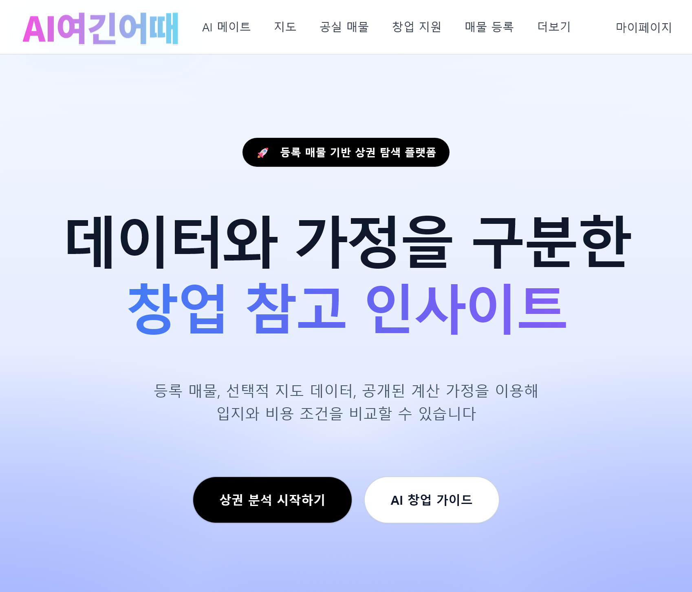
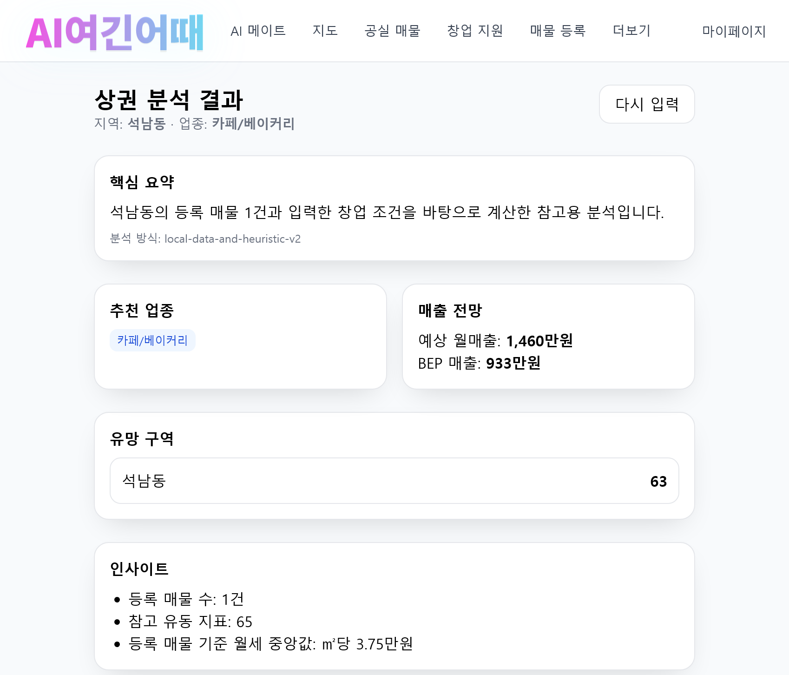
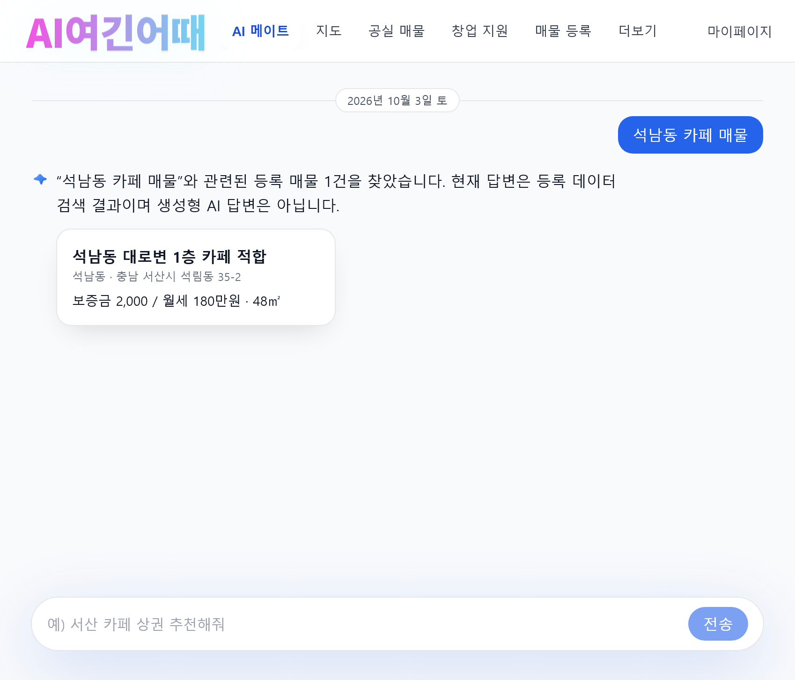
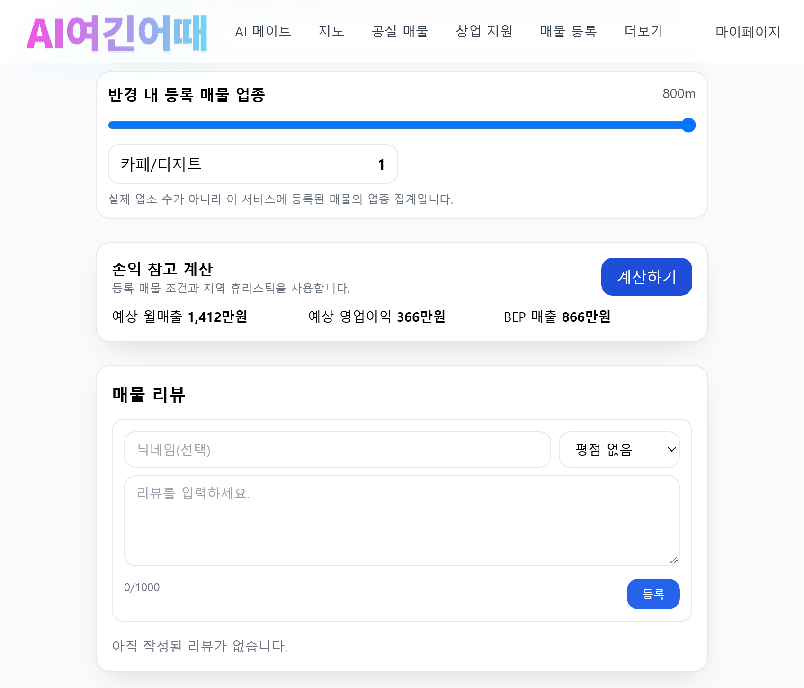

# 🏙️ AI여긴어때

> 공실 매물과 지역 정보를 탐색하고,  
> 창업 조건에 따라 입지·비용을 비교할 수 있도록 만든 **상권·공실 탐색 웹 서비스**입니다.

이 프로젝트는 **2025 멋쟁이사자처럼 중앙해커톤**에서 시작되었습니다.

해커톤 당시에는 **Frontend를 단독으로 담당**했으며,  
대회 종료 이후 프로젝트를 개인적으로 계속 수정하면서  
현재는 React 기반 Frontend와 Express API Server를 함께 포함하는 형태로 발전시켰습니다.

---

## Project Overview

| 항목 | 내용 |
| --- | --- |
| **Project** | AI여긴어때 |
| **Origin** | 2025 멋쟁이사자처럼 중앙해커톤 |
| **Hackathon Role** | Frontend 단독 담당 |
| **Current Status** | 해커톤 이후 개인적으로 개선한 버전 |
| **Frontend** | React 18 · TypeScript · Vite · Tailwind CSS |
| **Server** | Node.js · Express |
| **Structure** | npm Workspaces 기반 Monorepo |

> 해커톤 당시에는 Frontend 화면 구현을 담당했지만  
> 제한된 개발 기간과 경험 부족으로 팀 Backend와의 API 연동까지 완료하지 못했습니다.
>
> 현재 저장소의 `server/`는 당시 팀 Backend 결과물이 아니라,  
> 해커톤 종료 이후 프로젝트를 개인적으로 개선하면서 추가·보완한 별도 구현입니다.

---

## Project History

### 1. 2025 Central Hackathon

2025 멋쟁이사자처럼 중앙해커톤에서  
서비스의 **Frontend 전체를 단독으로 담당**했습니다.

당시에는 화면 구성과 사용자 흐름 구현을 우선적으로 진행했지만,  
Frontend와 Backend 사이의 API 연동 방식에 대한 이해가 부족해  
대회 기간 안에 실제 서비스 통합까지 완료하지 못했습니다.

이 경험을 통해 단순한 화면 구현뿐만 아니라  
**Frontend와 Backend 사이의 API 명세와 데이터 구조가 중요하다는 점**을 처음 크게 체감했습니다.

### 2. Post-hackathon Personal Development

대회가 끝난 뒤 프로젝트를 그대로 두지 않고  
개인적으로 Frontend와 Server를 계속 수정하고 보완했습니다.

현재 저장소에는 해커톤 당시보다 다음과 같은 기능과 구조가 추가되어 있습니다.

- TypeScript 기반 Frontend 구조 정리
- React Router 기반 페이지 Routing
- Axios API Layer 구성
- 공통 Layout / Component 분리
- 공실 매물 CRUD
- 리뷰 / 즐겨찾기
- 지도 기반 매물 탐색
- 창업 조건 기반 참고 분석
- Express API Server
- 입력값 Validation / Error Handling
- JSON 기반 데이터 저장
- Server Test

> 현재 공개 저장소는 해커톤 이후 별도로 정리한 버전이며,  
> 당시 개발 과정 전체가 Git commit history에 그대로 보존되어 있지는 않습니다.

---

<!--
## Screenshots

<table>
  <tr>
    <td align="center">
      
      <br/>
      <b>Home</b>
    </td>
    <td align="center">
      
      <br/>
      <b>Listings</b>
    </td>
  </tr>
  <tr>
    <td align="center">
      
      <br/>
      <b>Map</b>
    </td>
    <td align="center">
      
      <br/>
      <b>Market Analysis</b>
    </td>
  </tr>
  <tr>
    <td align="center">
      
      <br/>
      <b>AI Mate</b>
    </td>
    <td align="center">
      
      <br/>
      <b>Listing Detail</b>
    </td>
  </tr>
</table>

---
-->

## Service

현재 저장소 기준 주요 기능입니다.

### 🏢 공실 매물

- 공실 매물 조회 / 상세 조회
- 키워드·지역·업종 검색
- 매매 / 전세 / 월세 필터
- 가격 / 면적 / 인기 / 최신순 정렬
- 매물 등록 및 관리
- LH 공공상가 공고 조회 지원

### 🗺️ 지도 기반 탐색

- Kakao Maps 기반 지도
- 지역별 등록 매물 수 표시
- 시·군·구 / 읍·면·동 단위 탐색
- 지역별 업종 분포 확인
- 키워드 및 테마 기반 지도 검색

### 📊 창업 참고 분석

- 조건 기반 매물 추천
- 예상 매출 / 영업이익 / BEP 참고 계산
- 지역 간 조건 비교
- 지역·업종 조건 기반 상권 참고 분석

### 👤 사용자 기능

- 즐겨찾기
- 리뷰 등록 / 수정 / 삭제
- 내가 등록한 매물 조회
- 방문자 식별 Key 기반 데이터 구분

### 📰 창업 지원

- 창업 관련 뉴스 조회
- 청년창업 / 지원금 / 정책 / 교육·멘토링 필터
- 키워드 검색

---

## Hackathon Contribution

해커톤 당시에는 **Frontend를 혼자 담당**했습니다.

주요 담당 영역은 다음과 같습니다.

- Landing / Home 화면
- 상권 분석 입력 화면
- 공실 매물 관련 화면
- 지도 기반 탐색 UI
- 분석 결과 화면
- 공통 Header / Navigation / Layout
- 페이지 Routing 및 사용자 흐름

> 현재 저장소의 일부 화면과 기능은  
> 해커톤 종료 이후 개인적으로 추가하거나 수정한 내용입니다.

해커톤 당시에는 UI 구현을 중심으로 진행했으며,  
팀 Backend API와의 실제 통합은 완료하지 못했습니다.

---

## Post-hackathon Improvements

대회 종료 이후에는 프로젝트를 개인적으로 다시 구성하면서  
Frontend뿐 아니라 Client / Server 사이의 데이터 흐름까지 직접 다뤘습니다.

### Frontend

현재 Frontend는 다음 구조를 사용합니다.

```text
frontend/src/
├─ components/       # 공통 UI Component
├─ views/            # 페이지 단위 화면
├─ services/         # API 요청 및 Type
├─ shared/           # Layout / Error / 404
├─ lib/              # 인증 Key / Kakao Map
├─ router.tsx
└─ main.tsx
```

주요 개선 사항:

- React Router 기반 다중 페이지 구성
- `lazy()` 기반 페이지 단위 동적 로딩
- 공통 `MainLayout` 적용
- Axios 기반 API Layer 분리
- TypeScript를 이용한 API Response Type 관리
- 공통 Error Handling

### Server

현재 `server/`는 **해커톤 당시 팀 Backend가 아니라 개인 후속 구현**입니다.

초기에는 Frontend 연동을 시도하는 과정에서 생성형 AI의 도움으로 시작되었고,  
이후 프로젝트를 계속 수정하면서 기능과 구조를 개인적으로 보완했습니다.

현재 주요 기능은 다음과 같습니다.

```text
Express API
├─ Listings CRUD
├─ Reviews
├─ Favorites
├─ Market Analysis
├─ Map / Region Statistics
├─ Public Data Integration
└─ CSV Upload
```

Server 내부 기능은 역할에 따라 분리되어 있습니다.

```text
server/
├─ services/
│  ├─ ai.js
│  ├─ metrics.js
│  ├─ store.js
│  ├─ validation.js
│  ├─ security.js
│  ├─ lh.js
│  ├─ news.js
│  └─ geocode.js
│
├─ tests/
├─ data/
├─ app.js
└─ server.js
```

---

## AI / Analysis

프로젝트 이름에는 `AI`가 포함되어 있지만,  
**현재 구현된 분석 및 채팅 기능은 LLM이나 생성형 AI 모델을 사용하지 않습니다.**

현재 기능은 주로 다음 데이터를 이용합니다.

- 등록 매물 데이터
- 지역별 참고용 휴리스틱
- 사용자 입력 조건
- Keyword Matching

### Recommendation

매물 추천은 다음 요소를 이용해 참고 점수를 계산합니다.

- 유동 관련 참고 지표
- 청년층 참고 지표
- 임대비용
- 동일 지역·업종 경쟁 매물
- 사용자 선호도

현재 추천 방식은 코드에서 다음과 같이 구분합니다.

```text
method: heuristic-v2
```

### Simulation

사용자가 입력한 면적, 임대료, 인건비, 기타 비용, 원가율 등을 이용해

- 예상 매출
- 영업이익
- BEP 매출

을 계산합니다.

이는 실제 매출 예측 모델이 아니라  
**서비스 흐름 구현을 위한 참고용 계산 결과**입니다.

### AI Mate

현재 AI Mate 역시 생성형 AI Chatbot이 아닙니다.

사용자의 입력 Keyword를 등록 매물의:

```text
제목 · 주소 · 지역 · 업종 · 테마
```

와 비교해 관련 매물을 검색하는 방식입니다.

따라서 화면에서도 결과가  
**생성형 AI 응답이 아닌 등록 데이터 검색 결과**임을 표시하도록 구성했습니다.

---

## Data & Reliability

프로젝트를 후속 개선하면서  
**실제 데이터와 참고용 계산값을 구분하는 것**을 중요하게 다뤘습니다.

예를 들어:

- 등록 매물과 휴리스틱 기반 지표 구분
- 외부 뉴스 API가 없을 때 임의 뉴스 생성하지 않음
- LH API 사용 불가 시 자체 등록 매물만 표시
- 분석 응답에 계산 방식 표시
- API 오류 발생 시 사용자에게 오류 상태 표시

등을 적용했습니다.

---

## Visitor Ownership

현재 프로젝트는 정식 회원가입 시스템 대신  
브라우저마다 생성되는 방문자 식별 Key를 사용합니다.

이 Key를 기준으로:

- 내가 등록한 매물
- 작성한 리뷰
- 즐겨찾기

를 구분합니다.

Server에서는 원본 Key를 그대로 저장하지 않고  
`SHA-256` 기반 Hash 값을 이용해 저장합니다.

> 실제 상용 인증 시스템을 대신하기 위한 구조가 아니라,  
> 로그인 기능 없이 사용자별 데이터를 구분하기 위한 프로토타입 방식입니다.

---

## Tech Stack

### Frontend

| Category | Technology |
| --- | --- |
| Framework | React 18 |
| Language | TypeScript |
| Build Tool | Vite |
| Styling | Tailwind CSS |
| Routing | React Router DOM |
| HTTP Client | Axios |

### Server

| Category | Technology |
| --- | --- |
| Runtime | Node.js |
| Framework | Express |
| Data Storage | JSON File |
| File Processing | Multer, csv-parse |
| Test | Node.js Test Runner |

### External Integration

| Category | Service |
| --- | --- |
| Map | Kakao Maps |
| Geocoding | Kakao / Naver 관련 코드 |
| Public Listings | LH Public Data |
| Startup News | External News API |

일부 외부 기능은 별도의 API Key 및 환경변수 설정이 필요합니다.

---

## Project Structure

```text
AI-here-2026/
├─ frontend/
│  ├─ src/
│  │  ├─ components/
│  │  ├─ views/
│  │  ├─ services/
│  │  ├─ shared/
│  │  ├─ lib/
│  │  ├─ router.tsx
│  │  └─ main.tsx
│  └─ package.json
│
├─ server/
│  ├─ services/
│  ├─ tests/
│  ├─ data/
│  ├─ app.js
│  ├─ server.js
│  └─ package.json
│
├─ package.json
└─ package-lock.json
```

루트 `package.json`에서 Frontend와 Server를  
npm Workspaces로 함께 관리합니다.

---

## Limitations

현재 프로젝트는 상용 서비스를 목표로 완성된 시스템이 아니라  
**해커톤 결과물을 기반으로 개인적으로 개선한 학습·프로토타입 프로젝트**입니다.

- 현재 Server는 해커톤 당시 팀 Backend와 별개의 개인 후속 구현입니다.
- Database 대신 JSON 파일 저장소를 사용합니다.
- 회원 인증 대신 방문자 Key 기반의 간단한 식별 방식을 사용합니다.
- AI 분석은 LLM이 아닌 등록 데이터 및 휴리스틱 기반 참고 기능입니다.
- 일부 지도·뉴스·공공데이터 기능은 외부 API 설정이 필요합니다.

따라서 분석 결과는 실제 투자 또는 창업 의사결정을 위한 수치가 아니라  
서비스 흐름과 데이터 활용 방식을 구현하기 위한 **참고용 결과**입니다.

---

## Getting Started

### Requirements

- Node.js 20+
- npm

### Install

```bash
git clone https://github.com/developer-sw/AI-here-2026.git
cd AI-here-2026

npm install
```

이 프로젝트는 npm Workspaces를 사용하므로  
루트에서 한 번의 `npm install`로 Frontend와 Server 의존성을 관리합니다.

### Environment Variables

Frontend:

```powershell
Copy-Item frontend/.env.sample frontend/.env
```

Server:

```powershell
Copy-Item server/.env.sample server/.env
```

Kakao Maps, Geocoding, 공공데이터 등의 기능을 사용하려면  
각 `.env`에 필요한 환경변수를 설정해야 합니다.

### Run Server

```bash
npm run dev:server
```

```text
http://localhost:5050/api
```

### Run Frontend

다른 Terminal에서:

```bash
npm run dev:frontend
```

```text
http://localhost:3000
```

---

## Verification

Type Check, Server Test, Frontend Build를 한 번에 실행할 수 있습니다.

```bash
npm run check
```

실행 순서:

```text
Frontend Type Check
        ↓
Server Test
        ↓
Frontend Build
```

---

## What I Learned

이 프로젝트를 통해 **Frontend 전체를 혼자 구현하는 경험**과 함께,  
화면 구현만으로는 하나의 서비스가 완성되지 않는다는 점을 배웠습니다.

해커톤 당시 Backend 연동을 완료하지 못했던 경험을 계기로  
대회 이후 Client / Server 통신 구조를 다시 살펴보고  
Frontend와 Server를 개인적으로 수정하고 보완했습니다.

그 과정에서 다음 내용을 학습했습니다.

- React 기반 다중 페이지 서비스 구성
- TypeScript 기반 API Type 관리
- React Router를 이용한 화면 흐름 관리
- Axios 기반 Client / Server 통신
- 공통 Component / Layout 분리
- REST API와 CRUD 데이터 흐름
- Validation / Error Handling
- 간단한 사용자 데이터 소유권 처리
- JSON 기반 Server Data 관리
- Server Test 작성
- 실제 데이터와 추정값을 구분해 표현하는 중요성

특히 **Frontend와 Backend 사이의 데이터 구조와 API 명세가  
서비스 완성도에 직접적인 영향을 준다는 점**을 배운 프로젝트입니다.

현재는 이 경험을 바탕으로  
Java / Spring Boot 기반 Backend 개발을 중심으로 역량을 확장하고 있습니다.
